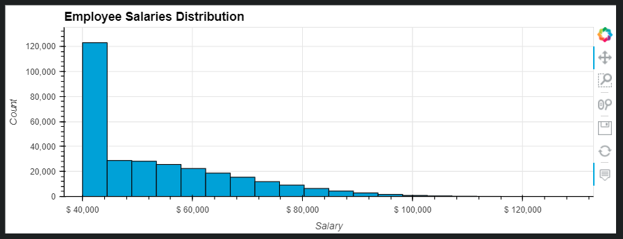

# SQL Challenge

In this challenge, we'll be creating an HR database for a company and running queries to return various types of information retrieved from different tables.

The steps for this challenge include:

* We use an ERD (Entity Relationship Diagram) to build the database structure  
* Create tables using PostgresSQL code
* Import data from .csv files using Pandas and Python code  
* Create Foreign key relationships between the database tables in PostgresSQL  
* Build queries in SQL to return the different types of information we're looking for
* Pull data from the SQL database to a Jupyter notebook to do data analysis and visualization  
* Create plots in Jupyter notebook based on the data  

The proper order to successfully demonstrate this project is:

1. Create a database called hr_db in PostgreSQL.  
2. Create your .env file and enter your database name, port number, user information.  
3. Run the Create Tables portion of the hr_database_create_tables.sql code.  
4. Run the CSV_Data_to_SQL_Table.ipynb code to load the data from the .csv files into the PostgresSQL tables.  
5. Run the add Foreign Keys from the hr_database_create_tables.sql code.  
6. Run the hr_queries.sql file to retrieve the desired data.  
7. Run the SQL_Data_to_Pandas.ipynb file to pull the data from SQL database to a Jupyter notebook in pandas for analysis.

